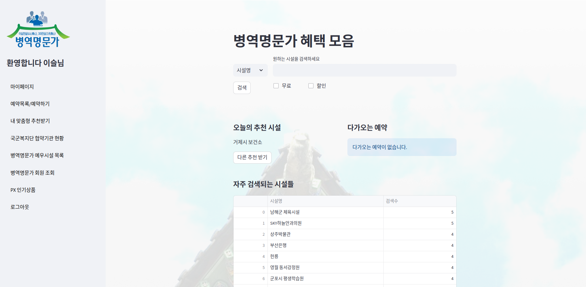

### BKMS_termproject

## 호국명문 혜택백서
**서비스 설명:** 다양한 병역명문가 예우시설 정보를 통합 관리하고 예약, 추천 등의 시스템을 갖추어 병역명문가 대상자들이 보다 쉽게 접근하고 이용할 수 있도록 서비스이다. 자긍심과 편의 도모와 함께 사회적 존경과 감사를 비롯하여 명예로운 병역의 가치 확산에 기여한다. <br/>

(* 병역명문가란? 3대가 병역의 의무를 마친 가문)

<br/>

### [**Team Members**]<br/>
\* 이슬 (기획)  ds_seul@snu.ac.kr <br/>
\* 임보영 (기획)  boyng707@snu.ac.kr <br/>
\* 오민제 (개발)  kosair99@gmail.com <br/>
\* 최영윤 (개발)  youngyoon911@snu.ac.kr <br/>

<br/>

## Overview

 

<br/>

## Activate website
```sh
pip install streamlit
streamlit run frontend.py
```

<br/>


## 기능 소개
1. 로그인 및 회원가입 기능
2. 개인 정보 수정 기능
3. 시설명/지역/업종 별 검색 기능
4. 면제/할인 구분별 검색
5. 협약기관/예우시설 목록 조회 시 필터링 기능
6. 시설 예약 기능
7. 사용 후기 등록 및 별점 기능
8. 시설 추천 및 유사 사용자 패턴 분석을 통한 맞춤형 추천 기능
9. 검색 수 count 및 랭킹 기능
10. 평점 랭킹
11. 시설 조회 시 같은 지역 우대시설 추천
12. 시설 조회 시 같은 지역 관광지 추천
